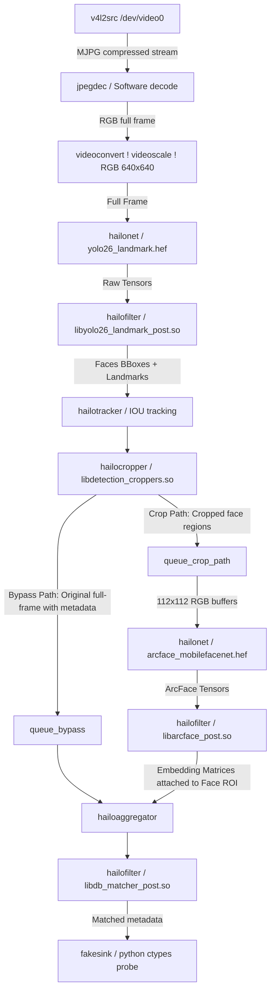

# Pipeline Architecture & Hardware Requirements

This document provides a detailed technical summary of the hardware-accelerated GStreamer / C++ Tappas pipeline designed for the Smart Lab Access Control System. The architecture achieves near-zero CPU usage by offloading all image scaling, cropping, object tracking, deep learning inference (YOLOv8-Face + ArcFace), and database matching to the Hailo-8L NPU and optimized GStreamer C/C++ elements.

---

## 1. Pipeline Data Flow (Mermaid Diagram)

The pipeline uses GStreamer's branching capabilities to isolate the full-frame face detection path from the cropped-frame face recognition path, merging them back, performing fast database matching in C++, and rendering the HUD overlay using zero-copy python ctypes:



---

## 2. Pipeline Element Details

The following table summarizes the roles and properties of the elements used in the pipeline:

| Element | Name | Primary Function | Key Properties / Configurations |
| :--- | :--- | :--- | :--- |
| `v4l2src` | (implicit) | Captures raw or compressed video frames from V4L2 USB camera devices. | `device=/dev/video0` |
| `jpegdec` | (implicit) | Decodes MJPG compressed camera streams in software. | Standard JPEG decoding |
| `videoscale` | (implicit) | Resizes decoded frames to the YOLO input dimensions. | `n-threads=2` (for low latency scaling) |
| `hailonet` | (YOLO detector) | Runs face detection and landmark regression on the Hailo-8L NPU. | `hef-path=yolo26_landmark.hef`, `vdevice-group-id=smart_door` |
| `hailofilter` | (YOLO post) | Parses raw NPU output tensors into bounding boxes and landmark structures. | `so-path=libyolo26_landmark_post.so` |
| `hailotracker` | (implicit) | Tracks detected face bounding boxes across frames using IOU (Intersection over Union). | Standard Hailo tracking defaults |
| `hailocropper` | `cropper` | Crops face bounding boxes from the main stream and scales them for ArcFace. | `so-path=libdetection_croppers.so`, `function-name=all_detections` |
| `hailonet` | (ArcFace recognition) | Extracts 512-dimension face embedding features on the Hailo-8L NPU. | `hef-path=arcface_mobilefacenet.hef`, `vdevice-group-id=smart_door` |
| `hailofilter` | (ArcFace post) | Wraps raw output tensors of ArcFace into `HailoMatrix` sub-objects. | `so-path=libarcface_post.so` |
| `hailoaggregator` | `agg` | Syncs and merges the cropped face embedding metadata back to the corresponding original frame. | Dual-sink inputs (`sink_0`, `sink_1`) |
| `hailofilter` | (DB Matcher) | Performs C++ vector similarity matching against local binary db cache on the NPU thread. | `so-path=libdb_matcher_post.so` |
| `fakesink` | `sink` | Renders custom Sci-fi HUD overlay directly on the frame buffer using Python ctypes. | `sync=true`, `emit-signals=true` |

---

## 3. Post-Processing & Shared Libraries (.so)

The GStreamer pipeline delegates heavy tensor parsing and database matching to pre-compiled C++ libraries loaded by `hailofilter` and `hailocropper`:

1. **`libyolo26_landmark_post.so`**:
   - Compiles YOLOv8-face output tensors.
   - Extracts bounding boxes and 5 facial keypoints (eyes, nose, mouth corners).
   - Attaches `HailoDetection` objects with landmark metadata to the frame's `HailoROI`.
2. **`libdetection_croppers.so`**:
   - Standard Tappas utility library.
   - Re-crops facial coordinates from the main frame and letterboxes them to `112x112` for ArcFace input.
3. **`libarcface_post.so`**:
   - Parses the `1x1x1x512` output tensor of the ArcFace network.
   - Converts it into a float array wrapper (`HailoMatrix`) containing the 512-dim embedding.
   - Attaches the matrix to the respective face `HailoDetection` sub-object.
4. **`libdb_matcher_post.so`**:
   - Reads database embeddings from a fast, flat binary file (`scratch/db.bin`) synchronized by Python.
   - For every face ROI, it extracts the latest `HailoMatrix` embedding and performs optimized C++ dot-product similarity matching.
   - If similarity is high, it attaches a `HailoClassification` object (type `"recognition"`) containing the matched user's name and percentage.
   - **Crucial Optimization**: It clears all `HailoMatrix` objects from the cloned detection before sending it downstream. This prevents `hailotracker` from propagating old embeddings from frame to frame, resolving both memory leaks and the stagnant once-off recognition bug.

---

## 4. Python Pad Probe & Zero-Copy Ctypes HUD Drawing

A zero-copy Python pad probe is registered on the sink pad of `fakesink` to render the modern HUD:

- **Bypassing PyGObject Restrictions**: By default, PyGObject marks GStreamer buffer memory as read-only at the Python layer. To draw in-place, the pad probe calls the native C function `gst_buffer_map` via `ctypes`, obtaining the raw memory address pointer (`map_info.data`).
- **Zero-Copy NumPy Wrapping**: The raw C pointer is wrapped in a NumPy array using `np.ctypeslib.as_array`. This allows OpenCV to draw directly on the live video frame memory without copying buffers:
  ```python
  data_ptr = ctypes.cast(map_info.data, ctypes.POINTER(ctypes.c_ubyte))
  arr = np.ctypeslib.as_array(data_ptr, shape=(h, w, 3))
  ```
- **HUD Rendering**: Draws premium Sci-fi style corners around faces (Green for known, Red for unknown/unauthorized), Plots 5 landmark circles (magenta), and prints name and similarity percentage text.

---

## 5. Hardware & Weight Requirements

To run this pipeline successfully, the host system must meet the following hardware and software requirements:

### Hardware
- **Host CPU**: Raspberry Pi 5 (4GB or 8GB recommended).
- **AI Accelerator**: Raspberry Pi AI Kit or Hailo-8L M.2 NPU module.
- **Camera**: USB Webcam or Raspberry Pi Camera Module supporting MJPG compressed streaming.

### Weights & HEFs
- **Detection Model**: `models/yolo26_landmark.hef` (YOLOv8-Face model compiled for Hailo-8L).
- **Recognition Model**: `models/arcface_mobilefacenet.hef` (ArcFace model compiled for Hailo-8L).
- **SQLite Database**: `database/smart_door.db` containing enrolled user profiles and their 512-dim embeddings.
- **Binary DB Cache**: `scratch/db.bin` containing name strings and flat raw float matrices for C++ DB matcher.
